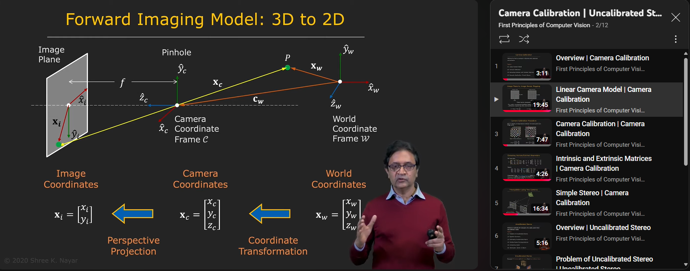
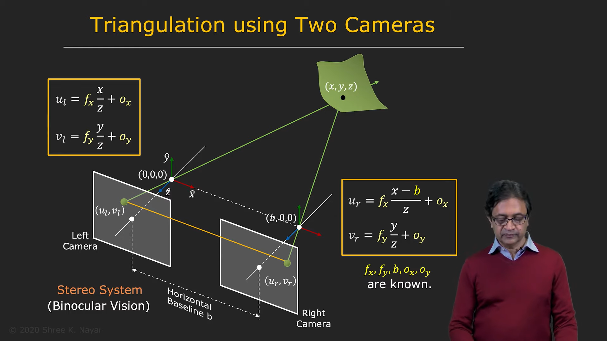
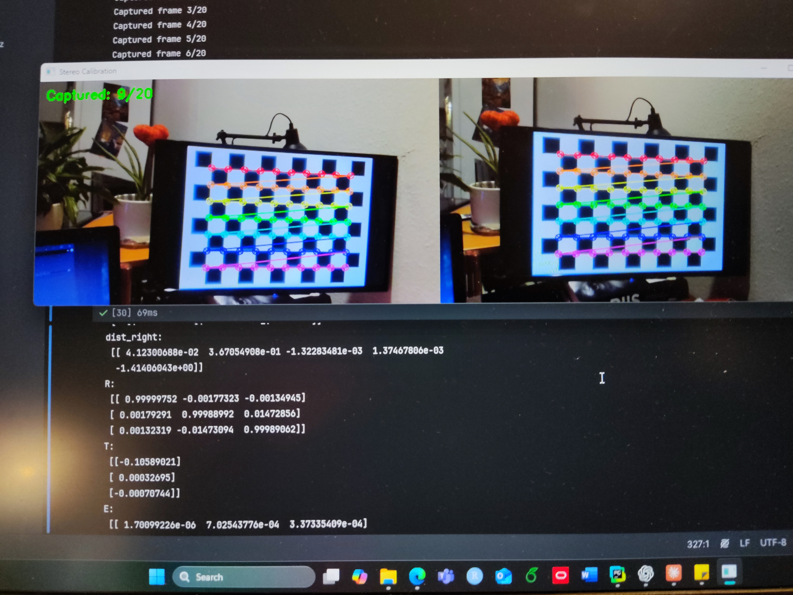

# SimpleStereoCam

This is a project that i did to improve my understanding of making a stereo camera and calibrate it to estimate distances of objects from the camera.
In the project i used two identical Microsoft modern webcams. I designed a frame for the camera setup using blender and 3D printed it.

## What do you need for the project?
1. Two cameras in the same model to prevent any mismatches in focal length, latency and other external and internal features
2. 3D printer (optional if you need a nice frame for the camera)
3. Calibration board (chess board image printed) - 9x6, 10x7 with known square size measurements
4. Computer with python installed and necessary libraries

## Lets get familiar with camera calibration

You can follow this youtube channel to understand the mathematics behind camera calibration which is highly important to understand the extrinsic and intrinsic parameters of the camera

<a href="https://www.youtube.com/@firstprinciplesofcomputerv3258" style="display: inline-block; background-color: #ff5733; color: white; padding: 10px 20px; text-decoration: none; border-radius: 8px; font-weight: bold;">First principles of Computer vision</a>


[](https://www.youtube.com/watch?v=S-UHiFsn-GI&list=PL2zRqk16wsdoCCLpou-dGo7QQNks1Ppzo)

Checkerboard i used for the calibration - 10x7 squares with 0.25mm size. 
Print this on a A4 paper and double check the measurement of the square before proceeding to calibration!


## Getting the first video feed from the camera setup
Here it is important to position your cameras in nearly same horizontal and vertical alignment to prevent any form of calibration errors. 
(Note - There are always inaccuracies when using standard consumer webcameras. but if you use industrial grade cameras with hardware synchronization, you can get a very accurate result)


## Baseline distance between the camera's optical centers



When choosing the baseline distance between two cameras, it's essential to consider the application environment—whether you're targeting long-range or short-range depth measurements. The baseline must be optimized for your specific use case.

In stereo vision systems, the baseline (the fixed distance between the two cameras) is key to determining depth accuracy. Objects appear in slightly different positions in the two camera images, a difference called **disparity**. This disparity is used to calculate an object's depth, as described by the equation:

Z = (f * B) / d


where:
- **Z** is the depth,
- **f** is the focal length,
- **B** is the baseline distance,
- **d** is the disparity.

Larger baseline:
- Better depth resolution for distant objects
- Wider field of view
- But harder to find corresponding points between images due to larger differences in perspective
- AND larger minimum measurable distance (blind spot close to cameras)

Smaller baseline:
- Better for measuring depth of closer objects
- Easier to find corresponding points (better matching)
- BUT reduced depth resolution for far objects
- AND more sensitive to calibration errors


## Getting the first video feed from the setup

Check what are the IDs of the cameras of the stereo setup before running the following code
```python
import cv2
import threading
import time
import numpy as np
from datetime import datetime

# Define a class to handle stereo camera operations
class StereoCamera:
    def __init__(self, left_id=0, right_id=1):
        # Initialize the left and right cameras using the provided device IDs
        self.left_cam = cv2.VideoCapture(left_id)
        self.right_cam = cv2.VideoCapture(right_id)

        # Configure camera settings for both cameras:
        # - Resolution: 960x540 pixels
        # - Frame Rate: 30 FPS
        # - Buffer Size: 1 (to minimize delay)
        for cam in [self.left_cam, self.right_cam]:
            cam.set(cv2.CAP_PROP_FRAME_WIDTH, 960)
            cam.set(cv2.CAP_PROP_FRAME_HEIGHT, 540)
            cam.set(cv2.CAP_PROP_FPS, 30)
            cam.set(cv2.CAP_PROP_BUFFERSIZE, 1)

        # Initialize FPS tracking variables for each camera
        self.left_fps = 0
        self.right_fps = 0
        self.left_fps_time = time.time()   # Timestamp to track FPS update for left camera
        self.right_fps_time = time.time()  # Timestamp to track FPS update for right camera
        self.frame_count_left = 0          # Frame counter for left camera
        self.frame_count_right = 0         # Frame counter for right camera
        self.fps_update_interval = 1.0     # Interval (in seconds) to update the FPS calculations

        # Warm up cameras by capturing a few frames to let auto-adjustments (like exposure) settle
        print("Warming up cameras...")
        for _ in range(30):
            self.left_cam.read()
            self.right_cam.read()

        # Wait a bit to ensure the cameras are ready
        time.sleep(2)
        print("Cameras ready!")

        # Initialize threading locks for safe access to the camera frames across threads
        self.left_lock = threading.Lock()
        self.right_lock = threading.Lock()

        # Initialize variables to hold the most recent frames from each camera
        self.left_frame = None
        self.right_frame = None

    def update_fps(self, camera='left'):
        # Update the frames per second (FPS) measurement for the specified camera
        if camera == 'left':
            current_time = time.time()
            time_diff = current_time - self.left_fps_time
            # If the specified time interval has passed, update FPS for left camera
            if time_diff >= self.fps_update_interval:
                self.left_fps = self.frame_count_left / time_diff  # Calculate FPS
                self.frame_count_left = 0  # Reset frame count
                self.left_fps_time = current_time  # Reset the time marker
        else:
            current_time = time.time()
            time_diff = current_time - self.right_fps_time
            # If the specified time interval has passed, update FPS for right camera
            if time_diff >= self.fps_update_interval:
                self.right_fps = self.frame_count_right / time_diff  # Calculate FPS
                self.frame_count_right = 0  # Reset frame count
                self.right_fps_time = current_time  # Reset the time marker

    def capture_frames(self):
        # Continuously capture frames from both cameras in a loop
        while True:
            ret_left, left = self.left_cam.read()   # Capture frame from left camera
            ret_right, right = self.right_cam.read()  # Capture frame from right camera

            # If both frames are successfully captured
            if ret_left and ret_right:
                # Use a lock to safely update the left frame and its FPS counter
                with self.left_lock:
                    self.left_frame = left
                    self.frame_count_left += 1
                    self.update_fps('left')

                # Use a lock to safely update the right frame and its FPS counter
                with self.right_lock:
                    self.right_frame = right
                    self.frame_count_right += 1
                    self.update_fps('right')
            else:
                # If capturing a frame failed, print an error message and wait briefly before retrying
                print("Frame capture failed")
                time.sleep(0.1)

    def show_feeds(self):
        # Start a separate thread to capture frames continuously from both cameras
        capture_thread = threading.Thread(target=self.capture_frames)
        capture_thread.daemon = True  # Mark thread as daemon so it exits when the main program terminates
        capture_thread.start()

        # Create a resizable window for displaying the stereo feeds
        cv2.namedWindow('Stereo Feeds', cv2.WINDOW_NORMAL)

        # Main loop for displaying the camera feeds
        while True:
            # Ensure that frames have been captured from both cameras
            if self.left_frame is not None and self.right_frame is not None:
                # Safely copy the current frames using locks to avoid thread conflicts
                with self.left_lock:
                    left_display = self.left_frame.copy()
                with self.right_lock:
                    right_display = self.right_frame.copy()

                # Get the current timestamp formatted as HH:MM:SS.milliseconds
                timestamp = datetime.now().strftime("%H:%M:%S.%f")[:-4]

                # Overlay the timestamp and left camera FPS on the left frame
                cv2.putText(left_display, f"Time: {timestamp}", (10, 30),
                            cv2.FONT_HERSHEY_SIMPLEX, 0.5, (0, 255, 0), 1)
                cv2.putText(left_display, f"Left FPS: {self.left_fps:.1f}", (10, 60),
                            cv2.FONT_HERSHEY_SIMPLEX, 0.5, (0, 255, 0), 1)

                # Overlay the timestamp and right camera FPS on the right frame
                cv2.putText(right_display, f"Time: {timestamp}", (10, 30),
                            cv2.FONT_HERSHEY_SIMPLEX, 0.5, (0, 255, 0), 1)
                cv2.putText(right_display, f"Right FPS: {self.right_fps:.1f}", (10, 60),
                            cv2.FONT_HERSHEY_SIMPLEX, 0.5, (0, 255, 0), 1)

                # Combine the left and right frames horizontally for side-by-side display
                combined_display = np.hstack((left_display, right_display))

                # Show the combined frame in the window
                cv2.imshow('Stereo Feeds', combined_display)

                # Check if the 'q' key is pressed to exit the display loop
                if cv2.waitKey(1) & 0xFF == ord('q'):
                    break

        # Clean up: close the window and release camera resources when done
        cv2.destroyAllWindows()
        self.left_cam.release()
        self.right_cam.release()

# Main execution block: run the stereo camera feed if this script is executed directly
if __name__ == "__main__":
    try:
        # Create an instance of the StereoCamera with default device IDs (0 and 1)
        stereo = StereoCamera(left_id=0, right_id=1)
        # Start displaying the stereo camera feeds
        stereo.show_feeds()
    except Exception as e:
        # In case of an error, print the error message and ensure windows are closed
        print(f"Error occurred: {str(e)}")
        cv2.destroyAllWindows()

```

## Calibrating the camera

Print your checker board on a A4 paper or A3 paper, and make sure you measure the size of each square as a precaution
In this example i displayed the checkerboard on a display and measured the square size. 



Here i added 20 calinration captures of the checher board and you can increase it if you need to 30 or 40

```python
#stereo calibration
#determining intrinsic and extrinsic parameters of the camera

import cv2
import numpy as np
import time
import threading

class StereoCalibrator:
    def __init__(self, left_id=0, right_id=1):
        self.left_cam = cv2.VideoCapture(left_id)
        self.right_cam = cv2.VideoCapture(right_id)

        # Set camera parameters
        for cam in [self.left_cam, self.right_cam]:
            cam.set(cv2.CAP_PROP_FRAME_WIDTH, 960)
            cam.set(cv2.CAP_PROP_FRAME_HEIGHT, 540)
            cam.set(cv2.CAP_PROP_FPS, 30)

        # Calibration parameters
        self.chessboard_size = (10, 7)  # Interior points
        self.square_size = 0.0357  # meters

        # Arrays to store calibration points
        self.objpoints = []  # 3D points in real world space
        self.left_imgpoints = []  # 2D points in left image
        self.right_imgpoints = []  # 2D points in right image

        # Prepare object points (0,0,0), (1,0,0), (2,0,0)...
        self.objp = np.zeros((self.chessboard_size[0] * self.chessboard_size[1], 3), np.float32)
        self.objp[:,:2] = np.mgrid[0:self.chessboard_size[0], 0:self.chessboard_size[1]].T.reshape(-1,2)
        self.objp *= self.square_size

        self.frame_count = 0
        self.required_frames = 20

    def find_chessboard(self, img):
        gray = cv2.cvtColor(img, cv2.COLOR_BGR2GRAY)
        ret, corners = cv2.findChessboardCorners(gray, self.chessboard_size, None)

        if ret:
            criteria = (cv2.TERM_CRITERIA_EPS + cv2.TERM_CRITERIA_MAX_ITER, 30, 0.001)
            corners = cv2.cornerSubPix(gray, corners, (11,11), (-1,-1), criteria)
            # Draw corners
            cv2.drawChessboardCorners(img, self.chessboard_size, corners, ret)

        return ret, corners

    def capture_and_calibrate(self):
        print("Starting calibration...")
        print("Press 'c' to capture a frame when chessboard is visible")
        print("Press 'q' to quit")

        while True:
            # Capture frames
            ret_left, left_frame = self.left_cam.read()
            ret_right, right_frame = self.right_cam.read()

            if not (ret_left and ret_right):
                print("Failed to capture frames")
                continue

            # Create copies for drawing
            left_display = left_frame.copy()
            right_display = right_frame.copy()

            # Find chessboard corners
            left_found, left_corners = self.find_chessboard(left_display)
            right_found, right_corners = self.find_chessboard(right_display)

            # Display frames count
            cv2.putText(left_display, f"Captured: {self.frame_count}/{self.required_frames}",
                      (10, 30), cv2.FONT_HERSHEY_SIMPLEX, 0.7, (0, 255, 0), 2)

            # Combine frames
            combined = np.hstack((left_display, right_display))
            cv2.imshow('Stereo Calibration', combined)

            key = cv2.waitKey(1) & 0xFF
            if key == ord('q'):
                break
            elif key == ord('c') and left_found and right_found:
                self.objpoints.append(self.objp)
                self.left_imgpoints.append(left_corners)
                self.right_imgpoints.append(right_corners)
                self.frame_count += 1
                print(f"Captured frame {self.frame_count}/{self.required_frames}")

                if self.frame_count >= self.required_frames:
                    self.perform_calibration()
                    break

        cv2.destroyAllWindows()
        self.left_cam.release()
        self.right_cam.release()

    def perform_calibration(self):
        print("\nPerforming calibration...")
        img_size = (960, 540)

        # Calibrate left camera
        ret_left, mtx_left, dist_left, rvecs_left, tvecs_left = cv2.calibrateCamera(
            self.objpoints, self.left_imgpoints, img_size, None, None)

        # Calibrate right camera
        ret_right, mtx_right, dist_right, rvecs_right, tvecs_right = cv2.calibrateCamera(
            self.objpoints, self.right_imgpoints, img_size, None, None)

        # Stereo calibration
        flags = cv2.CALIB_FIX_INTRINSIC
        criteria_stereo = (cv2.TERM_CRITERIA_EPS + cv2.TERM_CRITERIA_MAX_ITER, 100, 1e-5)

        ret_stereo, mtx_left, dist_left, mtx_right, dist_right, R, T, E, F = cv2.stereoCalibrate(
            self.objpoints, self.left_imgpoints, self.right_imgpoints,
            mtx_left, dist_left, mtx_right, dist_right, img_size,
            criteria=criteria_stereo, flags=flags)

        # Calculate rectification parameters
        R1, R2, P1, P2, Q, roi_left, roi_right = cv2.stereoRectify(
            mtx_left, dist_left, mtx_right, dist_right, img_size, R, T)

        print("\nCalibration complete!")
        print(f"Stereo calibration RMS error: {ret_stereo}")

        # Save all calibration parameters
        np.savez('stereo_calibration.npz',
                 mtx_left=mtx_left, dist_left=dist_left,
                 mtx_right=mtx_right, dist_right=dist_right,
                 R=R, T=T, E=E, F=F,
                 R1=R1, R2=R2, P1=P1, P2=P2, Q=Q)

        print("\nCalibration parameters saved to 'stereo_calibration.npz'")

if __name__ == "__main__":
    calibrator = StereoCalibrator(left_id=0, right_id=1)
    calibrator.capture_and_calibrate()
```

## loading the npz file to check the extrinsic and intrinsic paremeters

```python
#%%
#camera parameter check
import numpy as np

# Load the saved npz file
calib_data = np.load('stereo_calibration.npz')

# Print the keys (names of the arrays saved in the file)
print("Saved parameters:", calib_data.files)

# Optionally, print each parameter
for key in calib_data.files:
    print(f"{key}:\n", calib_data[key])

```
### Parameters in the npz file

<div style="border: 1px solid #ccc; padding: 15px; border-radius: 5px;">

**Stereo Camera Calibration Parameters**

**Left Camera Intrinsic Matrix (mtx_left):**  


